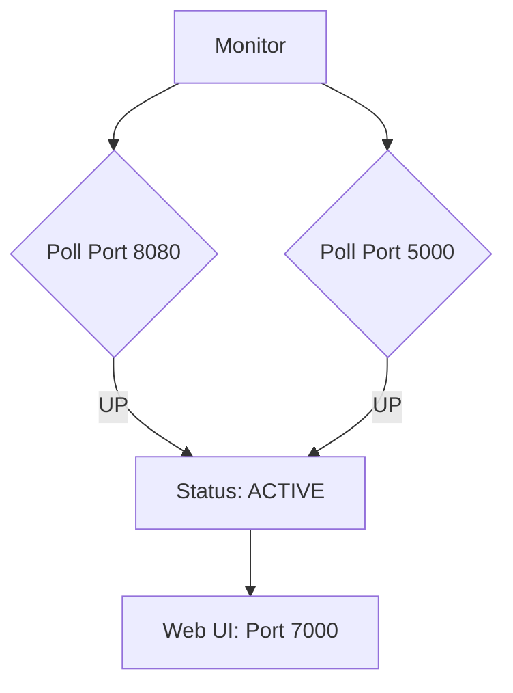

# 🌌 MATRIX DASHBOARD (v1.1)
[timedat: 2026-05-25]

## 🏗️ SYSTEM ARCHITECTURE

## 📈 PERFORMANCE METRICS
- **Latency:** < 50ms
- **Substrate:** Flask / Android 32-bit
- **Theme:** Dark Matrix Aesthetic

---
[STATUS: VISUAL_SINGULARITY_ACTIVE]
